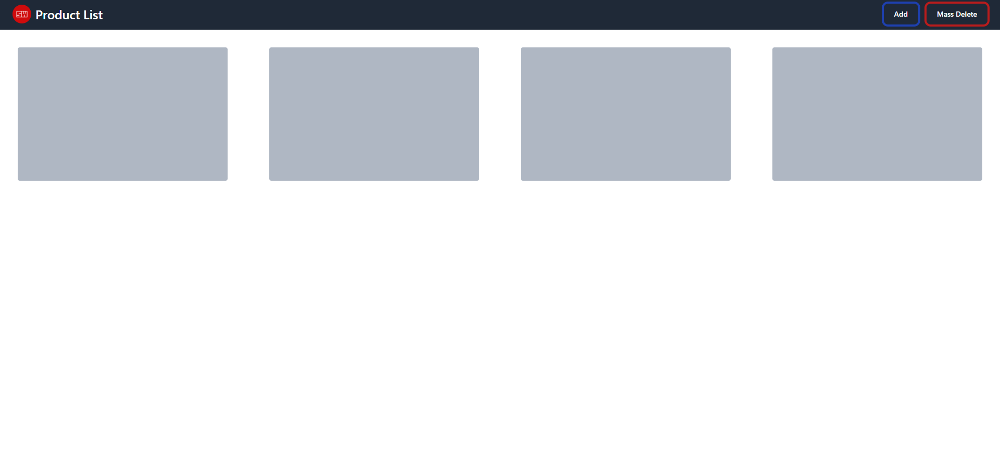
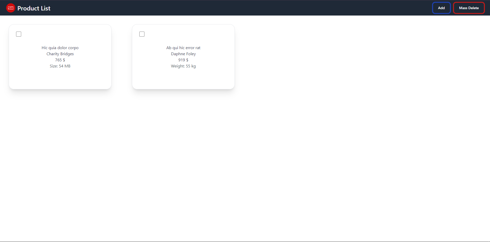
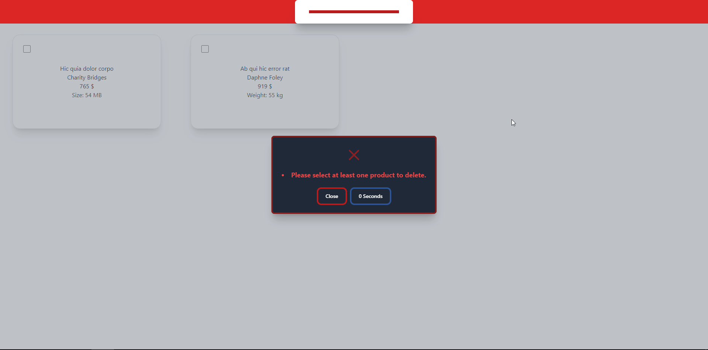
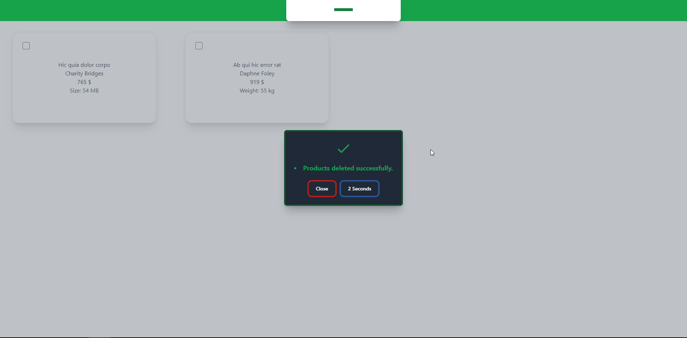
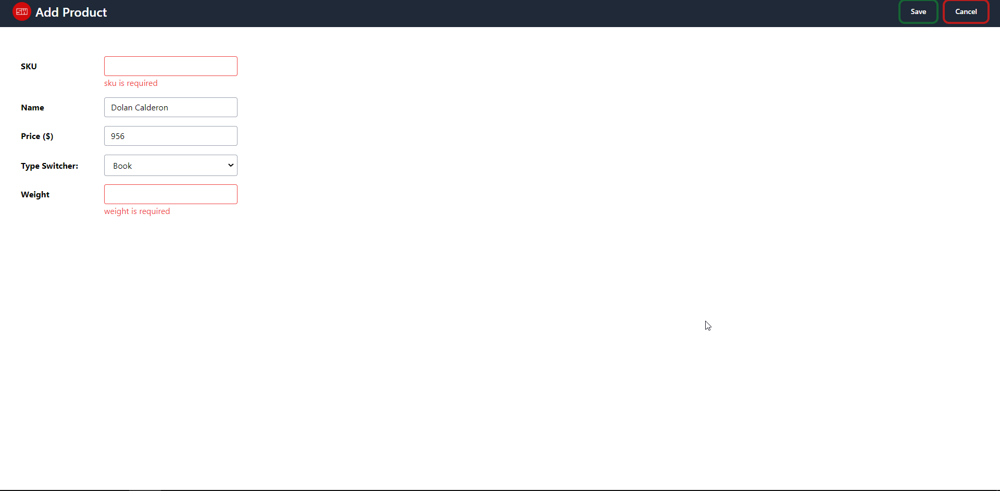
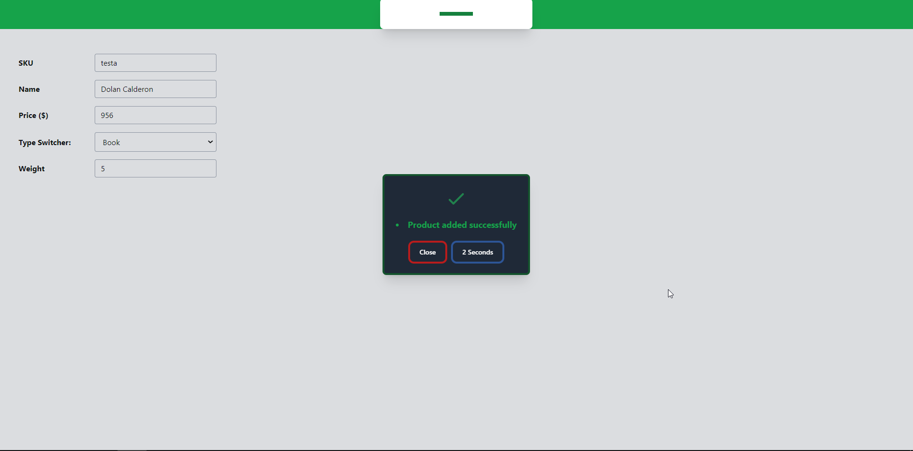
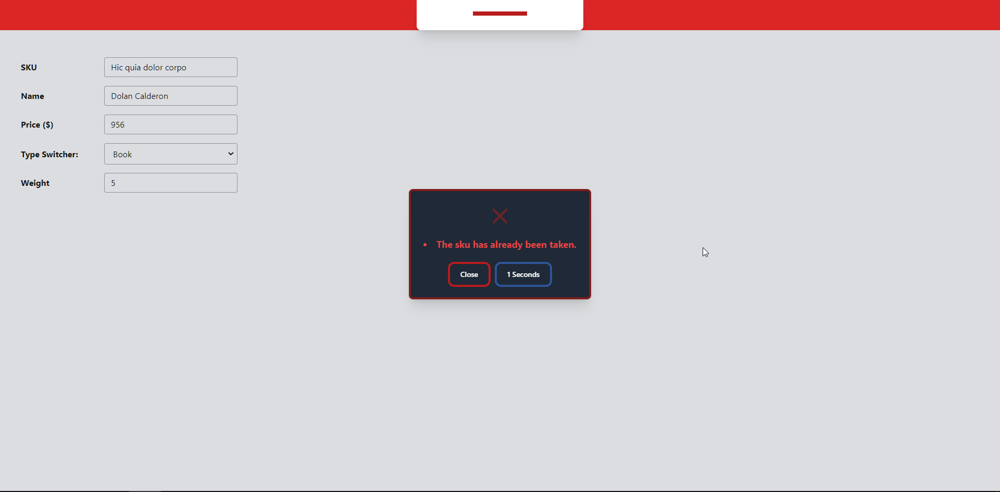

# Junior Developer Task

This is a web application for managing a list of products. It consists of two pages:

1. Product List
2. Add Product

## Table of Contents

- [Product List Page](#product-list-page)
    - [PHP](#php)
    - [Laravel-React](#laravel-react)
    - [Product List Loading](#product-list-loading)
    - [Mass Delete](#mass-delete)
- [Adding a Product Page](#adding-a-product-page)
    - [Validation](#validation)
- [Getting Started](#getting-started)
    - [Running the Project with PHPNative](#running-the-project-with-phpnative)
    - [Running the Project with Laravel and React](#running-the-project-with-laravel-and-react)

## Product List Page

This is the first page of the website, containing a list of products. Each product has a checkbox to delete it.

### PHP

- [Click here to view the Product List in PHP](http://pr0duct-list.atwebpages.com/)

### Laravel-React

- [Click here to view the Product List in Laravel and React](https://pr0duct-list.netlify.app/)
- [Click here to view the Postman Collection](https://documenter.getpostman.com/view/17382947/2s93XsYRon)

### Product List Loading

### Mass Delete

## Adding a Product Page

This page displays a form with the following fields:

- [Click here to view the Add Product page-> PHP](http://pr0duct-list.atwebpages.com/add-product)
- [Click here to view the Add Product page-> React](https://pr0duct-list.netlify.app/)

### Validation

Each field has a validation rule:

- SKU (Must be unique, doesn't allow any special characters)
- Name (Doesn't allow any special characters)
- Price (Must be a number)
- Product type switcher has the following options:
    - DVD
        - Size (Must be a number)
    - Book
        - Height (Must be a number)
        - Width (Must be a number)
        - Length (Must be a number)
    - Furniture
        - Weight (Must be a number)

## Getting Started

You have two options to run the project:

### Running the Project with PHPNative

1. Clone the repository: `git clone https://github.com/Moh-Bakr/JuniorDeveloperTask.git`
2. Navigate to the app directory: `cd JuniorDeveloperTask/PHP`
3. Create a MySQL database and import the `schemes.sql` file in the `Database` folder.
4. Edit the `connection.json` file in the `config` folder with your MySQL database credentials.
5. Start the PHP development server: `php -S localhost:8000`

### Running the Project with Laravel and React

1. First, Run The Laravel API
    - Clone the repository: `git clone https://github.com/Moh-Bakr/JuniorDeveloperTask.git`
    - Navigate to the app directory: `cd JuniorDeveloperTask/Laravel-React/Laravel`
    - Install the dependencies: `composer install`
    - Copy the `.env.example` file to `.env`: `cp .env.example .env`
    - Generate an application key: `php artisan key:generate`
    - Set up your database connection in the `.env` file
    - Migrate & seed the database: `php artisan migrate --seed`
